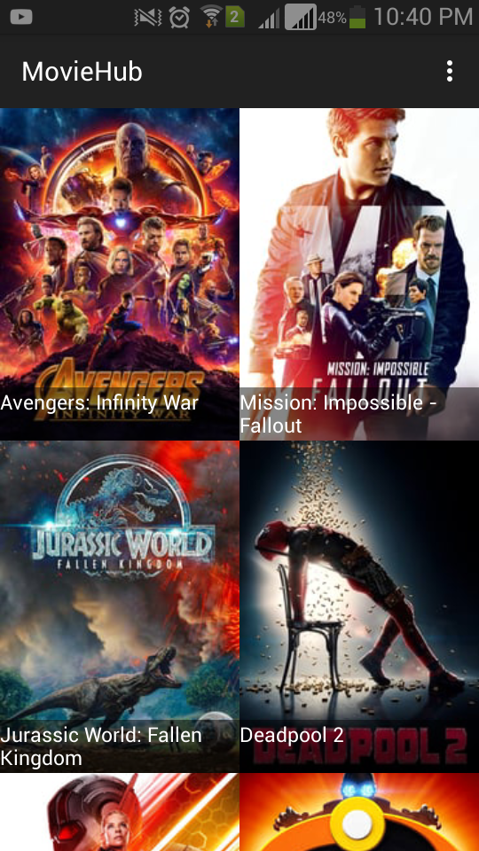

# MovieHub

This application was developed as a project in the Udacity Nanodegree program,it features the list of movies according to popularity and rating.
It also allows the user to add the movie as favorites.

## Screenshots

    
